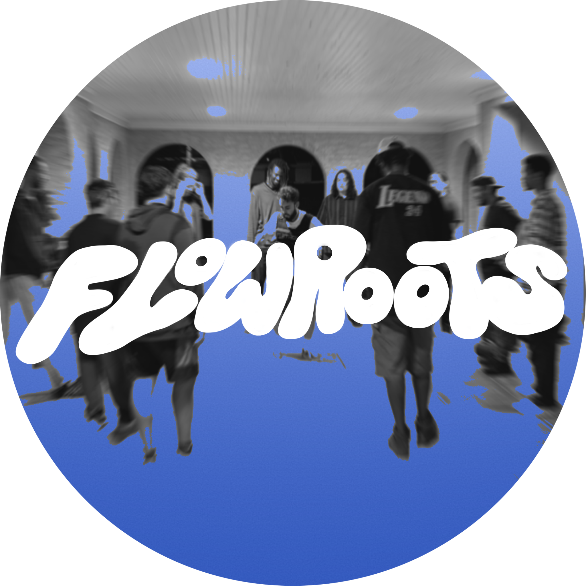

<p align="center">
  
</p>

<!-- <p align="center">
  <a href="https://www.instagram.com/flowrootsdallas/">
    
  </a>
</p> -->

## 💡 Vision
### “To strengthen and connect the street dance community through accessible, ethical AI tools.”

### A passion project centered around a useful tool for the local Dallas dance community, specifically street styles.

### The idea and vision is to create a hub and AI assistant focused on helping dancers in Dallas find their path and get assistance and updates on happenings such as events, cyphers, classes, etc. It may be used as a Point of Contact Site for outside organizations looking to interact with this niche community.

# FlowRoots App 🎶💃

A Python-based AI and community-driven project for dancers in styles such as **Popping, Robot, Animation, Tutting, and Waving**.  
FlowRoots aims to help dancers **learn, discover events, connect with communities, and preserve dance culture** — all through accessible technology.

---

## 🌱 Current Phase
We’re building the project from the ground up with:
- A **command-line interface (CLI)** foundation
- Placeholder modules for *Learn*, *Discover*, *Contribute*, and *Chatbot*
- Emphasis on **ethical, community-centered AI**

---

## 🧩 Structure

```plaintext
FlowRoots_App/
├── main.py
├── chatbot/
│ └── bot.py
├── modules/
│ ├── learn.py
│ ├── discover.py
│ └── contribute.py
├── data/
│ ├── events.json
│ └── styles.json
├── README.md
└── .gitignore
```


---

## 🚀 How to Run
1. Make sure you have Python 3.9+ installed  
2. Open a terminal in the project folder  
3. Run the app:
   ```bash
   python main.py

---

## ⚙️ Future Plans

* Integrate a real chatbot using LangChain or Transformers

* Add event scraping or API integration

* Build a lightweight web interface (Streamlit or Flask)

* Enable user submissions and local data persistence

## 🧠 Author

### Marc Anthony Aradillas
### FlowRoots Project | Dallas Dance Community
